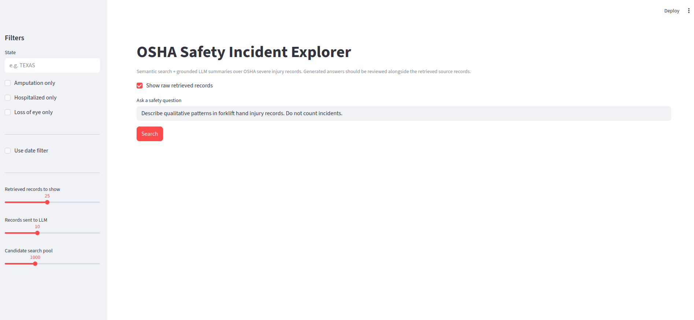
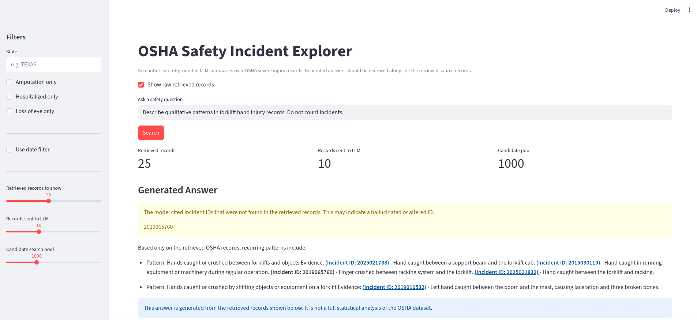
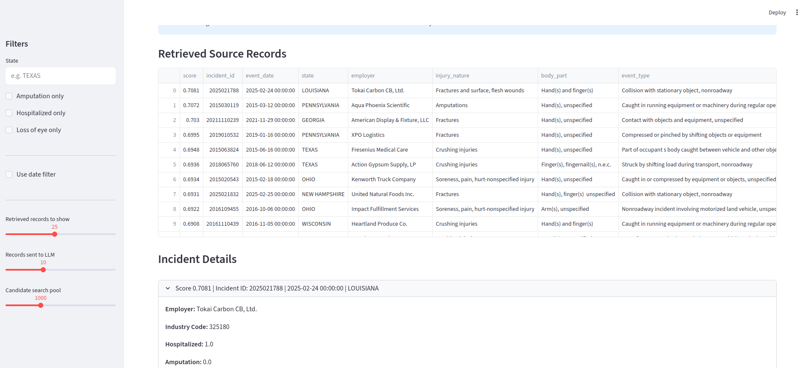
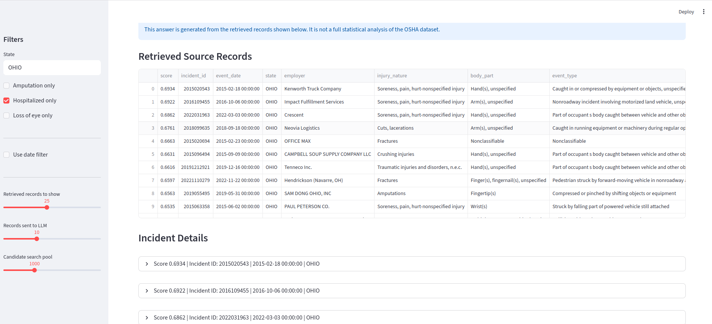

# OSHA Safety Incident RAG

## Overview
A local RAG application for exploring OSHA severe injury records using semantic search, metadata filters, and grounded LLM-generated summaries.

## Demo
The application supports semantic search over OSHA incident narratives, applies metadata filters, and generates grounded summaries with verifiable citations.

### Main Interface
Semantic search interface with filters and grounded LLM response.


### Generated Answer with Grounded Citations
LLM-generated summary constrained to retrieved records with clickable Incident ID citations and validation warnings for hallucinated IDs.


### Retrieved Source Records
Retrieved OSHA records are shown below the answer for source inspection and validation.


### Filtering Controls


## Why This Project
Safety incident data contains structured fields and unstructured narratives. This project shows how RAG can help users retrieve relevant incidents and summarize qualitative patterns while keeping source records visible.

## Features
- OSHA severe injury data ingestion and cleaning
- Search text generation from structured + narrative fields
- Sentence Transformer embeddings
- FAISS vector search
- Metadata filters
- Local LLM generation with Ollama
- Streamlit UI
- Clickable Incident ID citations
- Citation validation for hallucinated or altered IDs

## Key Design Decisions

- Enforced grounded responses using strict prompt constraints
- Implemented citation normalization and validation to detect hallucinated IDs
- Separated retrieval (k_display) from generation (k_llm) to balance recall and answer quality
- Used local LLM (Ollama) to keep the system fully self-contained

## Architecture

1. Data ingestion and cleaning from OSHA severe injury records
2. Search text construction combining structured + narrative fields
3. Embedding generation using Sentence Transformers
4. Vector indexing with FAISS
5. Semantic retrieval with metadata filtering
6. Grounded answer generation using a local LLM (Ollama)
7. Streamlit interface for query, filtering, and source inspection 

## How to Run
```bash
python -m venv .venv
source .venv/bin/activate
pip install -r requirements.txt

python -m scripts.run_pipeline
python -m scripts.rebuild_index

streamlit run app/streamlit_app.py
```

## Example Queries
- Describe qualitative patterns in forklift hand injury records. Do not count incidents.
- What patterns appear in conveyor-related amputation records?
- Describe ladder fall incidents.
- What patterns appear in chemical eye exposure incidents?

## Evaluation

The system was evaluated using a small curated query set across multiple hazard types (forklifts, conveyors, ladders, chemical exposure, and machinery).

Each query was assessed on:

- **Retrieval relevance**: Whether returned records matched the query intent  
- **Answer grounding**: Whether the LLM response was supported by retrieved records  
- **Citation quality**: Whether Incident IDs were correct, formatted, and linked  

Key observations:
- Retrieval performed strongly for equipment-specific queries (e.g., forklifts, conveyors)
- Answer quality depended on prompt constraints and number of retrieved records
- Citation validation successfully detected hallucinated or altered IDs

## Limitations
- Generated answers are qualitative summaries, not statistical analysis.
- Counts and rates should be computed with structured analytics, not the LLM.
- Local LLMs may alter IDs or over-generalize.
- The app validates citations and surfaces unsupported IDs instead of silently correcting them.

## Tech Stack
- Python
- pandas
- Sentence Transformers
- FAISS
- Ollama
- Streamlit
